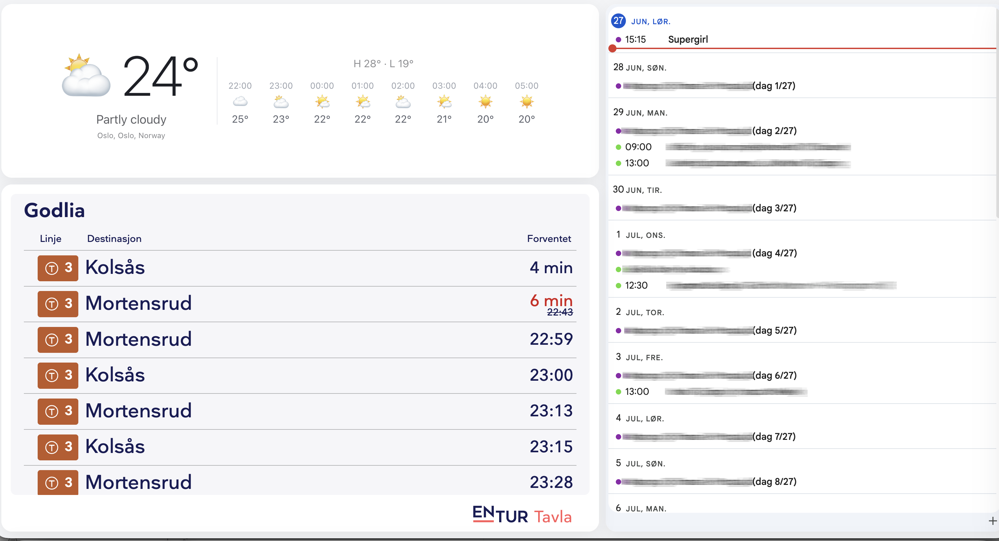
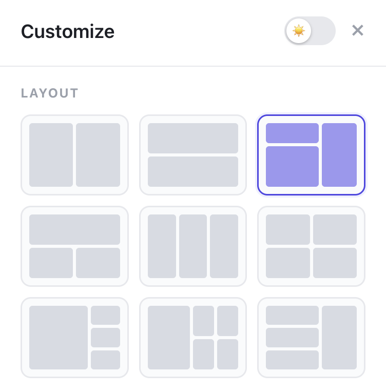
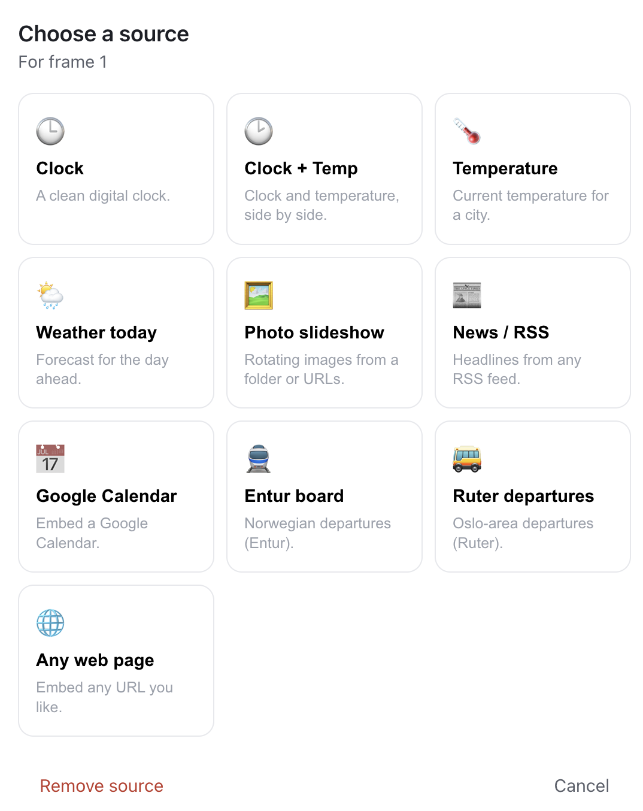

# Home Grid

A customizable home info screen for a wall-mounted tablet, spare monitor, or kiosk display. Split the screen into a grid of frames and fill each one with a clock, weather, photos, news headlines, a calendar, transit departures, or any web page. Everything runs in the browser — no build step, no server, no account.



## Features

- **Flexible layouts** — nine grid templates, from a simple two-pane split to a 2×2 grid or a feature pane with sidebars.
- **Native widgets** — clock, clock + temperature, temperature, daily weather forecast, and a photo slideshow.
- **Embeddable sources** — Google Calendar, Entur and Ruter departure boards, RSS/Atom news feeds, and arbitrary web pages via iframe.
- **No API keys** — weather and geocoding are powered by [Open-Meteo](https://open-meteo.com); RSS feeds load through the public [rss2json](https://rss2json.com) proxy.
- **Local photo folders** — point the slideshow at a folder on your machine (Chromium browsers) or supply a list of image URLs.
- **Light / dark theme** with per-widget colour and text-size overrides.
- **Auto-hiding chrome** and a fullscreen toggle, so the display stays clean when idle.
- **Persistent** — your layout and sources are saved to `localStorage` (folder handles to IndexedDB).

## Getting started

No build tools required. The app is plain HTML, CSS, and a single ES module.

Because it uses ES modules and browser APIs that need a secure context, serve it over `http` rather than opening `index.html` as a `file://` path:

```sh
# from the project directory
python3 -m http.server 8000
```

Then open <http://localhost:8000> in your browser.

> The local photo-folder picker (File System Access API) requires a Chromium-based browser such as Chrome or Edge, served over `http://localhost` or `https`. Other browsers can still use image URLs for the slideshow.

## Usage

Open the **Customize** panel from the gear icon in the top-right toolbar.



1. **Pick a layout** from the grid of templates. The selected layout is highlighted.
2. **Toggle light / dark mode** with the switch in the panel header.
3. Each frame in the chosen layout appears in the **Frames** list — click **Choose** (or the ✎ pencil on any pane) to assign a source.

When you choose a frame, the source picker opens:



Pick a widget and fill in its settings (a city for weather, a feed URL for news, an embed code for a calendar, and so on). Native widgets also have an **Appearance** section for custom text colour, background, and text size. Click **Save** and the frame updates in place.

The toolbar auto-hides after a few seconds of inactivity; move the mouse or tap to bring it back. Use the fullscreen button for a true kiosk display.

## Available sources

| Source | Type | Notes |
| --- | --- | --- |
| Clock | native | Optional time zone via city search |
| Clock + Temp | native | Clock alongside current temperature |
| Temperature | native | Current temperature for a city |
| Weather today | native | Current conditions + hourly forecast |
| Photo slideshow | native | Local folder or list of image URLs |
| News / RSS | native | Any RSS or Atom feed |
| Google Calendar | iframe | Paste the calendar's embed code or URL |
| Entur board | iframe | Norwegian departures via [vis-tavla.entur.no](https://vis-tavla.entur.no) |
| Ruter departures | iframe | Oslo-area departures via [mon.ruter.no](https://mon.ruter.no) |
| Any web page | iframe | Embed any URL (some sites block embedding) |

## How it works

The app is built in three small layers, all in [`app.js`](app.js):

- **State** — the current theme, layout, and per-frame configuration, persisted to `localStorage`. Local photo-folder handles live in IndexedDB, since they can't be serialized to `localStorage`.
- **Layouts** — a registry of CSS-grid templates (`LAYOUTS`), each mapping named slots onto grid areas.
- **Widgets** — a registry (`WIDGETS`) where each entry defines its config fields and a `render(node, cfg)` function. Native widgets draw their own DOM; iframe widgets simply embed a URL.

Adding a new widget is a matter of appending an entry to the `WIDGETS` array.

## Project structure

```
index.html    markup: grid host, toolbar, customize panel, modal host
app.js        all application logic (state, layouts, widgets, UI)
styles.css    theming and layout styles
doc/          screenshots used in this README
```

## Privacy

Home Grid runs entirely in your browser. Configuration never leaves your device. The only network requests are to the third-party services you opt into — Open-Meteo for weather/geocoding, rss2json for feeds, and whatever pages you embed.
